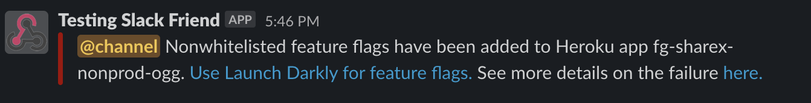

# ensure-new-feature-flags-are-done-in-launch-darkly

Ensures new feature flags are not added to Heroku environment config. Launch Darkly should be used to manage all feature flags going forward.

# Setup

Use the [workflow template](ensure-new-feature-flags-are-done-in-launch-darkly) and fill out the environment variables under "secrets.\*" in your repository secrets. Heroku event data can be accessed via "github.event.client_payload.heroku_webhook.\*" with full examples available in the [Heroku Webhooks via Cloudflare Workers documentation.](https://forgeglobal.atlassian.net/wiki/spaces/SHAR/pages/2104000554/Forwarding+Heroku+Webhooks+via+Cloudflare+Workers+to+Trigger+Github+Action+Workflows)

Heroku Api Key must have "read-protected,write-protected" scope in order to read/write env vars and deploy.

# How it works

A Heroku webhook with a shared HMAC secret in 1pass fires off a release event to a Cloudflare worker which verifies the HMAC secret and adds headers then forwards the event to a Github action repository_dispatch.

The Github action can listen to [different events.](https://forgeglobal.atlassian.net/wiki/spaces/SHAR/pages/2104000554/Forwarding+Heroku+Webhooks+via+Cloudflare+Workers+to+Trigger+Github+Action+Workflows#Overview)

The Github action checks if the release is current and the Heroku app is in one of the filtered Heroku pipelines. Then it ensures the Heroku env vars which start with "FEATURE\_" are all in the allow list. If an env var is found not in the allow list then it will remove that env var and push a new release to the Heroku app followed by a slack notification.

More information on the Heroku webhook forwarding via Cloudflare workers can be found in the [documentation.](https://forgeglobal.atlassian.net/wiki/spaces/SHAR/pages/2104000554/Forwarding+Heroku+Webhooks+via+Cloudflare+Workers+to+Trigger+Github+Action+Workflows#Overview)

# Output

Failure of this action will notify via slack:

